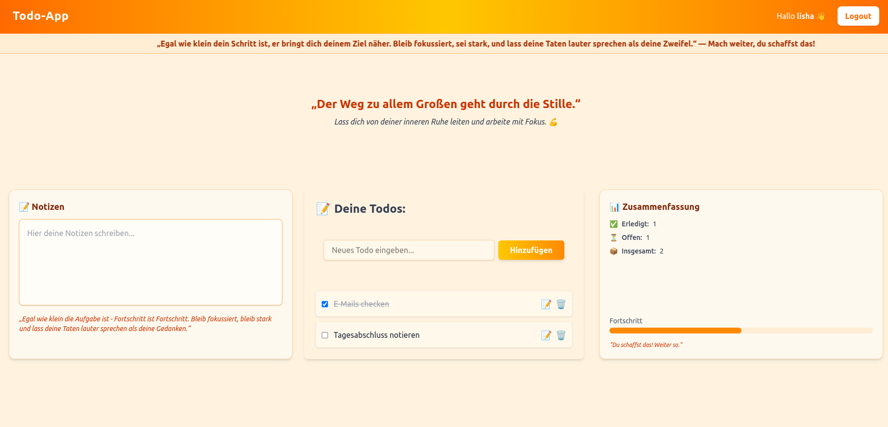

# 📝 Todo-App

Welcome to the **Todo-App** – your personal task manager with clean design, motivational features, and an engaging user experience!

---

## 🚀 Features

- ✅ User login with session storage
- 📝 Add, edit, and delete todos
- 📓 Write and manage personal notes
- 📊 View your progress summary (Completed / Open)
- 💬 Motivational text with scrolling animation
- 🎨 Fully responsive UI using Tailwind CSS
- 🔐 Logout with a motivational goodbye message

---

## 🛠️ Tech Stack

- **Frontend:** React (Next.js) + Tailwind CSS
- **Backend:** Node.js + Express
- **Data Storage:** Local JSON files (`users.json`, `todos.json`)
- **APIs:** RESTful APIs for login and todo management (GET, POST, PUT, DELETE)

---

**Note:** This project was built for learning purposes to explore and practice [mention technologies]. Security and production-level optimizations are not the primary focus.

## 📸 Preview

